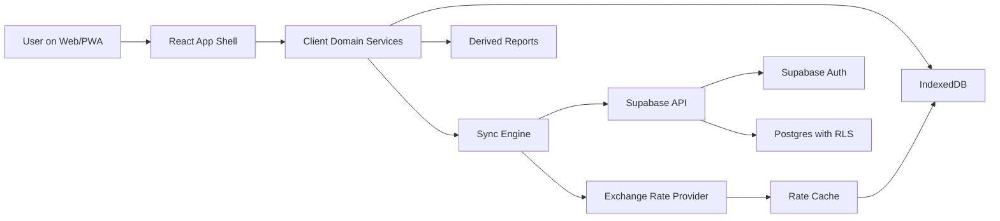

# MeuBills System Design

## Summary

MeuBills is a Vite + React + TypeScript PWA backed by Supabase Auth and Postgres. The app is offline-first on the client, with a strong local domain model and Supabase as the remote source of truth.

The MVP optimizes for trustworthy daily financial control and consolidated multi-currency net worth across BRL, USD, and BTC.

## Goals

- Work on mobile and web through an installable PWA.
- Use Portuguese Brazilian (pt-BR) for the app UI, formatting, and user-facing financial vocabulary.
- Keep the product usable offline.
- Sync automatically when online and provide a manual "sync now" action.
- Keep Supabase as the remote source of truth.
- Support financial groups, accounts, transactions, categories, tags, cards, invoices, reports, and multi-currency net worth.
- Keep the architecture ready to evolve without adding budgets, goals, notifications, Open Finance, or CSV import in the MVP.

## Non-goals

- Server-side rendering or SEO.
- Native mobile app.
- Open Finance integration.
- Budgeting and financial goals.
- Notifications and reminders.
- CSV import/export.
- Multi-account linked transfers.

## Stack

- Build: Vite.
- UI: React + TypeScript.
- PWA: service worker, manifest, app shell caching, offline UX.
- Local storage: IndexedDB for domain data, sync queue, exchange-rate cache, and derived local read models.
- Backend: Supabase Auth, Postgres, Row Level Security, generated TypeScript database types, and optional Edge Functions for exchange-rate fetching or privileged operations.
- Styling: CSS variables with RGB/HEX tokens, dark theme by default.

Vite docs confirm the current React TypeScript template shape with `@vitejs/plugin-react`, `VITE_*` environment variable conventions, and `public/` copying during production builds. Supabase docs confirm RLS policies using `auth.uid()` for user-owned data.

## Architecture



## Client Layers

### App Shell

Owns routing, navigation, authenticated layout, responsive nav, theme, and global status indicators.

Mobile uses bottom navigation. Desktop uses a collapsible/expandable sidebar. Mobile sections are Principal, Transações, central add action, Cartões, and Mais. Desktop sections are Novo, Dashboard, Contas, Transações, Cartões de crédito, Relatórios, Mais opções, and Configurações.

### Domain Services

Encapsulate financial behavior so UI components do not own business rules.

- Transaction service.
- Account service.
- Category and tag service.
- Credit card and invoice service.
- Recurrence service.
- Net worth service.
- Exchange-rate service.
- Sync service.

### IndexedDB

Stores:

- Local copies of server entities.
- Draft and pending changes.
- Sync queue.
- Exchange-rate cache.
- Derived report snapshots where useful.
- Local audit records for overwritten changes.

### Sync Engine

The sync engine tracks local mutations and pushes them to Supabase when online.

MVP conflict rule: last-write-wins with local audit. The server prevails when conflicts occur. The client may show that local changes were overwritten, but it does not attempt complex field-level merge.

Manual "sync now" triggers the same engine. Automatic sync runs when the app comes online, when the app becomes active, and after throttled mutation batches.

## Backend

### Supabase Auth

MVP auth supports e-mail/password and magic link. Sessions persist by default. The app has an explicit logout action.

Logout behavior:

- Show confirmation.
- Explain that local data and pending sync items for this device will be removed.
- Clear local database, sync queue, sensitive cache, and Supabase session.
- Keep already-synced server data.

### Postgres and RLS

Every user-owned table includes `user_id uuid not null references auth.users(id)`.

Enable Row Level Security on user data tables. Policies use `auth.uid()` so authenticated users can only read and mutate their own data.

Pattern:

```sql
alter table financial_groups enable row level security;

create policy "Users can manage own financial groups"
on financial_groups
for all
to authenticated
using ((select auth.uid()) = user_id)
with check ((select auth.uid()) = user_id);
```

### Type Generation

Generate TypeScript types from the Supabase schema and treat them as the boundary between remote persistence and client domain mapping.

The UI should not depend directly on raw database row names when domain language differs.

## Domain Model

### Core Entities

- User.
- Financial group.
- Account or wallet.
- Currency.
- Category.
- Subcategory.
- Tag.
- Transaction.
- Recurring rule.
- Credit card.
- Invoice.
- Invoice installment.
- Exchange rate snapshot.
- Sync operation.

### Financial Groups

Groups isolate operational reports. Examples: PF, PJ, Investimentos, Cripto, Exterior.

Accounts belong to one group. Categories and subcategories are scoped by group. Reports default to one group, while net worth can consolidate across groups.

The app requires at least one financial group to function. First use creates or seeds PF. After that, the app opens the last active group. Users can create groups manually in the UI or have an agent create them directly in the database.

Consolidado is a special aggregate view in the selector, not a persisted financial group.

Groups also carry visual identity metadata:

- Display name.
- Icon key.
- Accent color token.
- Default currency or primary asset.
- Sort order.
- Archived flag.

The UI uses group identity in selectors, dashboard sections, chart legends, account rows, and consolidated patrimonio breakdowns. Semantic finance colors still win over group colors for income, expense, warning, danger, and sync states.

Group management belongs in Mais > Configurações > Grupos financeiros. Daily financial flows should not mix group administration with transactions, accounts, or cards.

### Transactions

Transactions represent income or expense. Each transaction has:

- Group.
- Account.
- Currency inherited from account.
- Amount.
- Direction: income or expense.
- Status: pending or completed.
- Category and optional subcategory.
- Zero or more tags.
- Date.
- Optional recurrence reference.
- Sync metadata.

### Categories

Categories support one level of nesting: Categoria > Subcategoria.

### Credit Cards and Invoices

Credit cards have closing day and due day.

Invoices have status: open, closed, paid.

Installments appear in the corresponding month. Paying an invoice debits an account or wallet.

### Multi-currency Net Worth

Accounts can use BRL, USD, or BTC. Operational transactions always use the account currency.

Consolidated reports can convert to BRL, USD, or BTC. The user can still inspect native-currency values.

## Exchange Rates

Exchange rates are online-first with intelligent cache.

- When online, the app updates rates opportunistically.
- The app throttles requests and does not poll continuously.
- If the displayed rate was updated today, show `Atualizada às HH:MM`.
- If the displayed rate is from another date, show `Atualizada em DD/MM às HH:MM`.
- If the displayed rate is older than 1 hour, keep showing the timestamp clearly.
- Historical reports should use stored snapshots where possible so old reports remain reproducible.

An Edge Function can proxy external rate providers later to centralize API keys, throttling, and normalization.

## Reports

MVP reports:

- Monthly balance: income vs expenses.
- Expenses by category and subcategory.
- Monthly evolution.
- Account or wallet statement.
- Accounts payable and receivable.
- Credit card invoices by month.
- Net worth over time with monthly, 3-month, 6-month, and yearly filters.
- Distribution by currency or asset: BRL, USD, BTC.
- Balance projection using income, expenses, recurring entries, installments, and invoices.

Operational reports are scoped by financial group by default. Net worth can consolidate all groups.

## Dashboard Composition

The MVP dashboard is group-aware and intentionally Mobills-like in layout rhythm, dark surfaces, colorful summary cards, charts, and credit-card panels. The mobile home should be the primary reference. MeuBills differentiates through group identity, offline-first behavior, and multi-currency patrimonio.

Core dashboard content:

- Month selector.
- Summary cards: saldo atual, receitas, despesas, cartão de crédito.
- Top-left group chip/avatar with a bottom sheet for group switching.
- Despesas por categoria donut chart.
- Balanço mensal panel with receitas, despesas, and balance.
- Credit card panel with invoice status, short date labels, invoice amount, available limit, paid/open actions, and total.
- Links to deeper reports, such as desempenho and detailed cards.

When a group is selected, operational metrics are scoped to that group. Consolidated patrimonio can show all groups together, with each group visually identified.

Mobile home order:

1. Top shortcuts and month selector.
2. Current balance hero with visibility toggle.
3. Receitas and Despesas pair.
4. Pendências e alertas cards.
5. Cartões de crédito panel with faturas abertas/fechadas segmented control.
6. Bottom navigation with central add action.

Home mobile v1 decisions:

- The active group is shown in the top-left chip/avatar.
- The group selector opens a bottom sheet with real groups plus Consolidado.
- The central + opens quick actions for Despesa and Receita. Transferência stays out of the MVP unless explicitly added.
- Pendências e alertas uses two cards: Despesas pendentes and Faturas fechadas.
- Cartões de crédito is a high-priority Home section.
- Show all cards on the Home, sorted alphabetically by displayed name.
- Use a generic card icon, not card brand/bandeira.
- `Faturas abertas` rows show `Fecha em 29/jun.`, invoice amount, `Limite disponível R$ ...`, and a + action.
- `Faturas fechadas` rows show `Vence em 05/jun.`, invoice amount, `Limite disponível R$ ...`, and `Pagar` when payment is pending.
- Paid closed invoices show `Fatura paga`.
- Do not show limit bars or percentages on the Home.
- Show `TOTAL` in the card section footer.
- Tapping a card opens the current month invoice detail.

Research notes:

- Mobills documents that credit-card invoices can be viewed by status, such as faturas abertas and faturas fechadas, or by monthly visualization.
- Mobills documents that home cards can be customized and reordered.
- App-store material describes credit-card control, customized graphs/reports, income/expense tracking, cloud sync, and online/offline use.

## PWA and Offline Behavior

The PWA should load the app shell offline and show the last known local state.

Offline actions:

- Create, edit, and delete transactions.
- Review accounts, cards, invoices, and cached reports.
- Queue mutations for sync.
- Show stale exchange-rate timestamps.

Online actions:

- Authenticate.
- Sync queued mutations.
- Refresh exchange rates using throttled logic.
- Pull remote changes.

The UI must make sync state visible without becoming noisy.

## Localization

The MVP app language is pt-BR.

- Set document language to `pt-BR`.
- Format BRL, USD, and BTC values with Brazilian locale conventions.
- Format dates and times for Brazilian users.
- Use accented Portuguese strings in the UI, such as `Lançamentos`, `Relatórios`, `Cartão de crédito`, `Sincronização pendente`, and `Atualizada às HH:MM`.
- Keep internal code identifiers in English where useful, but map them to pt-BR labels at the UI boundary.

## Data Integrity

Financial data should prefer explicit states over hidden assumptions.

- Transactions are pending or completed.
- Invoices are open, closed, or paid.
- Exchange rates carry timestamps.
- Sync operations carry status and error details.
- Deleted records should use tombstones during sync, then be compacted when safe.

## Security

- RLS is mandatory on all user-owned tables.
- Client uses anon key only.
- Service role keys never ship to the browser.
- Sensitive local data is cleared on logout.
- Environment variables exposed to Vite use `VITE_*` and contain only public client configuration.

## Initial Delivery Order

1. Project scaffold and app shell.
2. Supabase local setup, migrations, RLS, and generated types.
3. Auth flow with persistent session and logout clearing local state.
4. IndexedDB schema and domain services.
5. Sync queue and basic conflict handling.
6. Financial groups, accounts, categories, tags, and transactions.
7. Credit cards and invoices.
8. Exchange-rate cache and multi-currency net worth.
9. Reports.
10. PWA install/offline polish.

## Open Decisions

- Exact exchange-rate provider.
- Whether exchange-rate fetching starts client-side or through an Edge Function.
- Exact IndexedDB helper library.
- Whether local data needs encryption beyond clearing it on logout.
